# 📋 Skema Use Case & Blueprint Sistem - INVENTERA

Dokumen ini mendefinisikan skema *Use Case*, matriks hak akses (*Role-Based Access Control*), alur bisnis utama, serta panduan implementasi teknis untuk sistem **Inventera** (Sistem Informasi Kasir & Inventaris Multi-Cabang Jayusman Retail).

---

## 🚀 1. Matriks Aktor & Hak Akses (RBAC)

Sistem ini dirancang dengan isolasi data berbasis cabang (**Branch-based Multi-tenancy**). Pengguna cabang A tidak diperbolehkan melihat atau memanipulasi data di cabang B. 

Berikut adalah pemetaan wewenang dari 5 tingkat hak akses berdasarkan dokumen PRD:

| Aktor / Role | Ruang Lingkup Data (Scope) | Otoritas Utama | Kolom Role DB |
| :--- | :--- | :--- | :--- |
| **Owner (Pak Jayusman)** | **Global** (Seluruh Cabang) | Melihat performa keuangan global, audit log total, CRUD Cabang, CRUD Manajer, CRUD Produk Master. | `owner` |
| **Manajer Toko** | **Cabang Terkait** (Tenant) | Mengelola operasional cabang, cetak laporan transaksi/stok, CRUD karyawan cabang (Supervisor, Kasir, Gudang), menyetujui Stock Opname. | `manager` |
| **Supervisor** | **Cabang Terkait** (Tenant) | Mengawasi kasir, memberikan *PIN/Password Approval* untuk pembatalan transaksi (*Void*), menyetujui koreksi stok ringan. | `supervisor` |
| **Pegawai Kasir** | **Cabang Terkait** (Tenant) | Melakukan input transaksi belanja (POS), memindai barcode, mencetak struk belanja, meminta void ke supervisor. | `cashier` |
| **Pegawai Gudang** | **Cabang Terkait** (Tenant) | Mencatat barang masuk (Inbound PO), melacak riwayat mutasi barang (Kartu Stok), mengajukan penyesuaian stok (Stock Opname). | `warehouse` |

> [!IMPORTANT]
> **Rekomendasi Perubahan Database Migration (`2026_05_18_000007_add_role_branch_to_users_table.php`):**
>
> Di migration awal, kolom enum role hanya berisi `['owner', 'manager', 'cashier']`. Untuk mengakomodasi kebutuhan operasional penuh Pak Jayusman, sangat disarankan untuk merefaktor kolom tersebut menjadi:
> ```php
> $table->enum('role', ['owner', 'manager', 'supervisor', 'cashier', 'warehouse'])->default('cashier');
> ```

---

## 📊 2. Diagram Use Case (Visual Mermaid)

Berikut adalah diagram hubungan aktor dengan fungsi sistem (Use Cases) yang terbagi berdasarkan hak akses:

```mermaid
rect rgb(20, 23, 33)
  state "Sistem Inventera (Jayusman Retail)" as System {
    state "Modul Auth & Master" as ModAuth {
      usecase1["UC-01: Login Terpusat"]
      usecase2["UC-02: Kelola Master Toko & Cabang"]
      usecase3["UC-03: Kelola Akun Karyawan"]
      usecase4["UC-04: Kelola Master Produk & Harga"]
    }

    state "Modul Inventori & Gudang" as ModInv {
      usecase5["UC-05: Catat Barang Masuk (Inbound PO)"]
      usecase6["UC-06: Riwayat Mutasi (Kartu Stok)"]
      usecase7["UC-07: Pengajuan Stock Opname"]
      usecase8["UC-08: Persetujuan Koreksi Stok"]
    }

    state "Modul Kasir (Point of Sales)" as ModPOS {
      usecase9["UC-09: Proses Transaksi Belanja"]
      usecase10["UC-10: Cari Produk & Scan Barcode"]
      usecase11["UC-11: Ajukan Pembatalan Item (Void)"]
      usecase12["UC-12: Otorisasi PIN/Password Void"]
    }

    state "Modul Laporan & Audit" as ModReport {
      usecase13["UC-13: Cetak Laporan Transaksi (PDF/Excel)"]
      usecase14["UC-14: Cetak Laporan Stok Cabang"]
      usecase15["UC-15: Pantau Audit Log Keamanan"]
    }
  }
```

### Pemetaan Aktor ke Use Case

```mermaid
graph TD
  %% Aktor
  Owner((Owner - Pak Jayusman))
  Manager((Manajer Toko))
  Supervisor((Supervisor))
  Cashier((Pegawai Kasir))
  Warehouse((Pegawai Gudang))

  %% Modul Auth & Master
  Owner --> UC02[UC-02: Kelola Cabang]
  Owner --> UC04[UC-04: Kelola Produk Master]
  Owner --> UC15[UC-15: Pantau Audit Log Global]
  
  Manager --> UC03[UC-03: Kelola Akun Karyawan Cabang]
  Manager --> UC13[UC-13: Cetak Laporan Cabang]
  Manager --> UC08[UC-08: Setujui Stock Opname Berat]

  Supervisor --> UC12[UC-12: Otorisasi Void POS]
  Supervisor --> UC08[UC-08: Setujui Koreksi Stok Ringan]

  Cashier --> UC09[UC-09: Proses POS Belanja]
  Cashier --> UC10[UC-10: Scan Barcode/Cari Produk]
  Cashier --> UC11[UC-11: Minta Void]

  Warehouse --> UC05[UC-05: Inbound Barang Masuk]
  Warehouse --> UC06[UC-06: Pantau Kartu Stok]
  Warehouse --> UC07[UC-07: Ajukan Stock Opname]

  %% General Link
  allUsers[Semua Aktor] --> UC01[UC-01: Login Terpusat]
```



---

## 📑 3. Spesifikasi Fungsional Use Case

### 3.1 Modul Autentikasi & Data Master

#### **UC-01: Login Terpusat**
- **Deskripsi:** Pengguna masuk ke sistem menggunakan email dan password.
- **Pre-kondisi:** Akun terdaftar di database dan status `is_active` bernilai `true`.
- **Alur Utama:**
  1. Pengguna mengakses sistem di halaman Login.
  2. Sistem melakukan validasi kredensial (bcrypt).
  3. Sistem mengidentifikasi `role` dan `branch_id` pengguna.
  4. Sistem menyimpan session dan me-redirect ke Dashboard yang terisolasi sesuai cabang.

#### **UC-02: Kelola Master Toko & Cabang**
- **Deskripsi:** Menambah, mengubah, atau menonaktifkan cabang mini-market.
- **Aktor Utama:** Owner (Pak Jayusman).
- **Alur Utama:**
  1. Owner membuka menu **Manage Branches**.
  2. Owner dapat memasukkan nama cabang, kode unik (mis. JKT-01), kota, alamat, nama manajer, dan status aktif.
  3. Perubahan disimpan di tabel `branches`.

#### **UC-03: Kelola Akun Karyawan**
- **Deskripsi:** Membuat dan mengelola akun staf operasional di bawah cabang terkait.
- **Aktor Utama:** Owner (lintas cabang), Manajer Toko (terbatas pada cabangnya saja).
- **Aturan Bisnis:** Manajer Toko Cabang A **tidak boleh** melihat, mengubah, atau membuat akun karyawan untuk Cabang B.

#### **UC-04: Kelola Master Produk & Harga**
- **Deskripsi:** Mengelola database barang yang dijual secara sentral.
- **Aktor Utama:** Owner (Pak Jayusman).
- **Aturan Bisnis:** Produk dikelola terpusat (Satu SKU berlaku nasional), namun jumlah **stok fisiknya** diisolasi per cabang di tabel `inventories`.

---

### 3.2 Modul Inventori & Gudang

#### **UC-05: Pencatatan Barang Masuk (Inbound PO)**
- **Deskripsi:** Pegawai Gudang mencatat stok barang yang baru dikirim oleh supplier untuk dimasukkan ke rak atau gudang cabang.
- **Aktor Utama:** Pegawai Gudang.
- **Alur Utama:**
  1. Pegawai Gudang membuat pengajuan penerimaan berdasarkan Purchase Order (PO) yang dikirim supplier.
  2. Pegawai memeriksa kondisi fisik barang dan menginput `quantity_received`.
  3. Setelah dikonfirmasi, sistem secara otomatis:
     - Mengubah status PO menjadi `received` atau `partial`.
     - Menambahkan nilai `stock` pada tabel `inventories` cabang terkait.
     - Menulis riwayat transaksi barang ke *Audit Log* mutasi stok.

#### **UC-06: Riwayat Mutasi (Kartu Stok / Stock Ledger)**
- **Deskripsi:** Melacak setiap pergerakan satu SKU dari waktu ke waktu (Kapan dibeli, kapan dijual di kasir, kapan dikoreksi).
- **Aktor Utama:** Pegawai Gudang, Supervisor, Manajer Toko.
- **Aturan Bisnis:** Sistem memfilter riwayat mutasi secara otomatis berdasarkan `branch_id` aktor yang sedang login.

#### **UC-07: Pengajuan Stock Opname (Penyesuaian Stok)**
- **Deskripsi:** Menyesuaikan selisih stok sistem dengan hitungan fisik riil di gudang (karena barang hilang, rusak, atau salah hitung).
- **Aktor Utama:** Pegawai Gudang.
- **Aturan Bisnis:** Pegawai gudang **tidak boleh** secara langsung mengubah jumlah stok. Setiap penyesuaian wajib berstatus `pending` dan memerlukan persetujuan dari Supervisor atau Manajer.

---

### 3.3 Modul Point of Sales (POS / Kasir)

#### **UC-09: Proses Transaksi Belanja**
- **Deskripsi:** Kasir mencatat pembelian pelanggan, menghitung total belanja, memproses pembayaran, dan mengeluarkan struk belanja.
- **Aktor Utama:** Pegawai Kasir.
- **Alur Utama:**
  1. Kasir membuka modul POS (halaman transaksi responsif).
  2. Kasir mencari produk berdasarkan Nama atau memindai menggunakan **Barcode Scanner** (UC-10).
  3. Sistem mengambil harga jual produk dan memeriksa ketersediaan stok di cabang tersebut.
  4. Kasir memasukkan detail potongan/diskon (bila ada) dan sistem menghitung subtotal + pajak secara otomatis.
  5. Kasir memilih metode pembayaran (`cash`, `debit`, `qris`, dll) dan memproses checkout.
  6. Sistem memotong stok di tabel `inventories` cabang kasir secara *real-time*.
  7. Sistem mencetak struk fisik/nota dan mencatat riwayat transaksi ke tabel `transactions` & `transaction_items`.

#### **UC-11 & UC-12: Pengajuan & Otorisasi Void (Pembatalan Item)**
- **Deskripsi:** Fitur pengamanan agar kasir tidak dapat membatalkan item belanja yang sudah diinput tanpa pengawasan.
- **Aktor Utama:** Pegawai Kasir (Pengaju), Supervisor/Manajer (Otorisator).
- **Alur Bisnis:**
  ```
  [Kasir menekan tombol Void pada item]
                    ↓
  [Sistem mengunci layar & memunculkan modal PIN/Password Approval]
                    ↓
  [Supervisor datang dan memasukkan PIN/Password miliknya]
                    ↓
  [Sistem memvalidasi kredensial & otorisasi role supervisor]
                    ↓
  [Sistem mencatat di Audit Log: "Supervisor X menyetujui Void item Y oleh Kasir Z"]
                    ↓
  [Item dihapus dari keranjang kasir]
  ```

---

### 3.4 Modul Laporan & Keamanan

#### **UC-13: Cetak Laporan Transaksi (PDF / Excel)**
- **Deskripsi:** Mengekspor rangkuman transaksi penjualan berdasarkan rentang tanggal tertentu.
- **Aktor Utama:** Manajer Toko (cabang sendiri), Owner (seluruh cabang).
- **Format Output:** PDF (untuk cetak arsip) dan Excel/CSV (untuk dianalisis).

#### **UC-15: Pantau Audit Log Keamanan**
- **Deskripsi:** Catatan kronologis tak terhapuskan (*immutable*) yang merekam aktivitas kritis sistem demi mencegah manipulasi data oleh oknum pegawai.
- **Aktor Utama:** Owner (Pak Jayusman).
- **Komponen Audit Log:**
  - `user_id`: Siapa pelaku tindakan.
  - `branch_id`: Di cabang mana aksi terjadi.
  - `action`: Jenis aktivitas (e.g., `VOID_TRANSACTION`, `STOCK_OPNAME_APPROVED`, `EMPLOYEE_DEACTIVATED`).
  - `description`: Detail keterangan (e.g., "Supervisor Budi menyetujui void item SKU-001 senilai Rp 50.000").
  - `ip_address` & `user_agent`: Info teknis perangkat pelaku.

---

## 🔒 4. Mekanisme Multi-tenant & Isolasi Data Cabang

Untuk menjamin keamanan data dan menghindari "kebocoran" transaksi antar cabang (*cross-branch data leakage*), sistem **Inventera** menggunakan pendekatan **Single Database - Shared Schema** dengan kolom pembeda `branch_id` (*Tenant Identifier*).

### 4.1 Schema Relationship

```
  +------------------+
  |     branches     | <----+
  +------------------+      | (1 to many)
                            |
         +------------------+------------------+-------------------+
         |                  |                  |                   |
  +------+------+    +------+------+    +------+------+     +------+------+
  |    users    |    | inventories |    | transactions|     | purchase_obs|
  +-------------+    +-------------+    +-------------+     +-------------+
  | branch_id   |    | branch_id   |    | branch_id   |     | branch_id   |
  | role        |    | product_id  |    | user_id     |     | supplier_id |
  | email       |    | stock       |    | total       |     | status      |
  +-------------+    +-------------+    +-------------+     +-------------+
```

### 4.2 Penerapan Eloquent Global Scope (Automated Filtering)

Untuk memastikan pengembang tidak lupa menambahkan klausa `where('branch_id', $user->branch_id)` pada setiap query, kita wajib menggunakan **Eloquent Global Scope** di Laravel.

#### Contoh Implementasi Global Scope di Model:
```php
namespace App\Models\Scopes;

use Illuminate\Database\Eloquent\Builder;
use Illuminate\Database\Eloquent\Model;
use Illuminate\Database\Eloquent\Scope;
use Illuminate\Support\Facades\Auth;

class BranchScope implements Scope
{
    public function apply(Builder $builder, Model model): void
    {
        // Jika pengguna masuk dan bukan Owner, filter data berdasarkan cabang mereka
        if (Auth::check() && Auth::user()->role !== 'owner') {
            $builder->where('branch_id', Auth::user()->branch_id);
        }
    }
}
```

Terapkan Scope ini di model-model krusial (`Inventory`, `Transaction`, `User`, `PurchaseOrder`) agar sistem secara otomatis mengisolasi data tanpa perlu memikirkan filter manual di setiap controller.

---

## 🛠️ 5. Panduan Langkah Implementasi Berikutnya

Untuk melanjutkan pengembangan aplikasi ini, ikuti urutan langkah berikut agar terstruktur dengan baik:

### 🚀 Tahap 1: Setup Model & Relasi Database
1. Buat model-model Laravel yang belum ada beserta relasinya:
   - `Category.php`, `Product.php`
   - `Inventory.php` (relasi `belongsTo` ke `Branch` & `Product`)
   - `Customer.php`
   - `Transaction.php` & `TransactionItem.php`
   - `Supplier.php`, `PurchaseOrder.php` & `PurchaseOrderItem.php`
2. Konfigurasikan model `User.php` agar memiliki relasi `belongsTo` ke `Branch`.

### 🔐 Tahap 2: Refaktorisasi Migrasi Role & Autentikasi
1. Ubah migrasi `2026_05_18_000007_add_role_branch_to_users_table.php` untuk mendukung 5 role (`owner`, `manager`, `supervisor`, `cashier`, `warehouse`).
2. Jalankan perintah `php artisan migrate:fresh --seed` untuk membersihkan dan menata ulang database.
3. Buat Seeder (`DatabaseSeeder.php`) untuk memasukkan:
   - 1 data Owner (Pak Jayusman).
   - 5 data Cabang awal.
   - Akun *dummy* Manajer, Supervisor, Kasir, dan Gudang untuk masing-masing cabang demi kelancaran pengujian.

### 📊 Tahap 3: Implementasi Panel Admin (Filament PHP)
Sesuai rekomendasi PRD, gunakan **Filament PHP** untuk membangun menu manajemen data (Back-Office) dengan cepat:
1. Jalankan instalasi Filament di project.
2. Buat **Filament Resource** untuk:
   - `BranchResource` (Hanya bisa diakses Owner)
   - `ProductResource` (Hanya bisa diakses Owner)
   - `UserResource` (Dapat diakses Owner untuk semua cabang, Manajer hanya untuk cabang miliknya)
   - `InventoryResource` (Akses untuk Gudang, Supervisor, dan Manajer)
   - `SupplierResource` & `PurchaseOrderResource` (Akses Gudang & Manajer)
3. Terapkan **Global Scope** (`BranchScope`) pada model-model tersebut agar data tersaring otomatis berdasarkan cabang pengguna yang login.

### 🛒 Tahap 4: Halaman Custom Point of Sales (POS)
1. Buat rute khusus `/pos` yang dilindungi *middleware auth* khusus kasir.
2. Bangun antarmuka POS menggunakan **Blade + Tailwind CSS** (atau Livewire) dengan desain mewah *Modern Enterprise/Soft UI* berkinerja tinggi (< 1 detik load).
3. Implementasikan pencarian produk dinamis berbasis barcode atau teks.
4. Buat dialog konfirmasi PIN/Password Supervisor jika kasir memicu aksi `Void`.

### 📂 Tahap 5: Audit Trail & Modul Laporan
1. Pasang package `spatie/laravel-activitylog` atau buat sistem logging manual khusus untuk menyimpan riwayat audit krusial (void kasir, edit stok gudang, penonaktifan akun karyawan).
2. Tampilkan audit log ini di halaman dashboard khusus Owner (Pak Jayusman).
3. Buat tombol "Cetak Laporan" di admin panel Manajer yang memicu pembuatan **PDF** (`barryvdh/laravel-dompdf`) atau **Excel** (`maatwebsite/excel`) transaksi per rentang tanggal.

---

*Dokumen blueprint skema use case ini dibuat sebagai acuan utama tim pengembang untuk melanjutkan proyek **Inventera** milik Pak Jayusman.*
